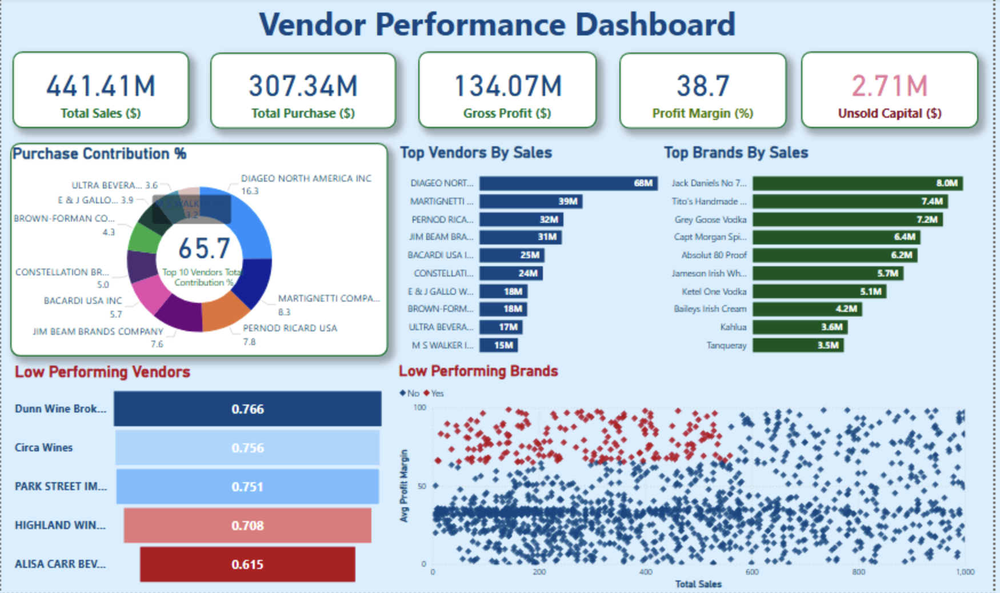

# Vendor Performance Data Analytics

An end-to-end data analytics project that evaluates vendor performance, profitability, purchase efficiency, and inventory turnover using SQL, Python, Jupyter notebooks, and Power BI.

## Project Overview

This project turns raw retail purchase and sales data into a vendor-level summary table, explores the results in notebooks, and presents the business story through a Power BI dashboard. The goal is to show how a data analyst can move from raw files to actionable insights without overengineering the workflow.

## Problem Statement

Retail teams need a clear view of which vendors drive profit, which products move slowly, and where bulk purchasing creates value or risk. This project focuses on answering those questions with a simple, defensible analytics pipeline.

## Tech Stack

- SQL and SQLite for data storage and aggregation
- Python for ingestion, cleaning, and KPI generation
- Pandas for data manipulation
- Jupyter Notebook for exploratory analysis
- Power BI for dashboard visualization
- GitHub for version control and project presentation

## Dataset Overview

The project works with retail-style source tables loaded from CSV files in the `data/` folder. The scripts expect source files such as purchases, sales, vendor invoice data, and purchase price reference data. The cleaned output is written into a local SQLite database named `inventory.db`.

## Key KPIs

- Total Purchase Dollars
- Total Sales Dollars
- Gross Profit
- Profit Margin
- Stock Turnover
- Sales-to-Purchase Ratio
- Freight Cost

## Dashboard Insights

- Vendor concentration is visible through top-vendor contribution to total purchases.
- Bulk ordering can reduce unit cost, but it should be balanced against inventory holding risk.
- Some brands show strong margin but weak sales volume, which is useful for promotion planning.
- Unsold inventory highlights slow-moving stock that may need clearance or revised buying decisions.
- Vendor segments can be compared by profitability to identify different sourcing strategies.

## Project Workflow

1. Place raw CSV files in `data/`.
2. Run the ingestion script to load them into SQLite.
3. Run the vendor summary script to build the analysis table.
4. Open the notebooks for exploratory analysis.
5. Review the Power BI dashboard for executive-style reporting.

## Folder Structure

```text
vendor-performance-analysis-sql-python-powerbi-test-main/
├── README.md
├── .gitignore
├── requirements.txt
├── Vendor Performance Report.pdf
├── data/
│   └── .gitkeep
├── dashboard/
│   └── vendor_performance.pbix
├── images/
│   └── dashboard.png
├── logs/
│   └── .gitkeep
├── notebooks/
│   ├── exploratory_data_analysis.ipynb
│   └── vendor_performance_analysis.ipynb
└── scripts/
    ├── ingestion_db.py
    └── get_vendor_summary.py
```

## Screenshots

### Dashboard Preview



### Additional Screenshots

- Add more dashboard or notebook screenshots in `images/` if you want to show extra visuals in interviews.
- Recommended filenames: `dashboard-2.png`, `kpi-summary.png`, `vendor-analysis.png`.

## How to Run the Project

### 1. Clone the repository

```bash
git clone https://github.com/rupesh1787/vendor-performance-data-analytics.git
cd vendor-performance-data-analytics
```

### 2. Create a virtual environment and install dependencies

```bash
python -m venv .venv
.venv\Scripts\activate
pip install -r requirements.txt
```

### 3. Add the raw data

Place the CSV source files in the `data/` folder before running the scripts.

### 4. Load the source tables into SQLite

```bash
python scripts/ingestion_db.py
```

### 5. Build the vendor summary table

```bash
python scripts/get_vendor_summary.py
```

### 6. Open the notebooks

- `notebooks/exploratory_data_analysis.ipynb`
- `notebooks/vendor_performance_analysis.ipynb`

### 7. Open the Power BI dashboard

- `dashboard/vendor_performance.pbix`

## Cleanup Notes

- The `logs/` folder is kept in the repo, but generated log files stay ignored.
- The SQLite database is created locally and is not meant to be committed.
- If you add more raw data files, keep them in `data/` and let `.gitignore` handle the generated artifacts.

## Future Improvements

- Add a single notebook that documents the full analysis narrative from start to finish.
- Parameterize file paths so the scripts can run from any working directory.
- Add automated data validation checks before loading source files.
- Create a lightweight Streamlit app for sharing the dashboard online.
- Add a data dictionary for the source tables and KPI definitions.

## Author

This repo is ready to use as a beginner-friendly portfolio project for campus placements and recruiter reviews.
